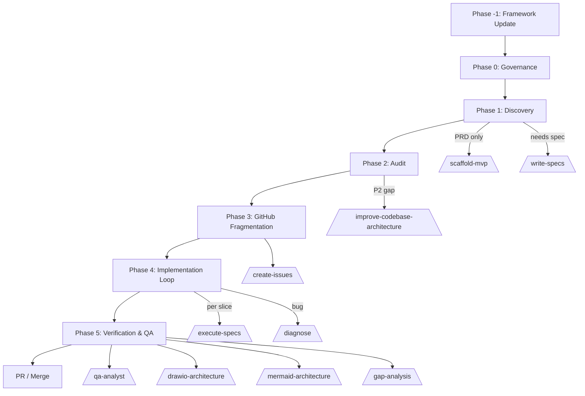

# Spec Driven

An orchestrator-first collection of Agent Skills for **spec-driven development**: the [`orchestrator`](docs/en/orchestrator.md) skill turns a PRD or idea into approved SPECs, tracked GitHub Issues, TDD-implemented slices, QA gates, and reviewed PRs — across Claude Code, OpenCode, Devin, Cursor, and other runtimes.

[](https://skills.sh/afonsoft/skills)
[](https://github.com/afonsoft/skills/actions/workflows/skills-validate.yml)
[](https://github.com/afonsoft/skills/actions/workflows/skills-validate.yml)
[](https://github.com/afonsoft/skills/actions/workflows/skills-validate.yml)
[](https://opensource.org/licenses/MIT)
[](https://agentskills.io)
[](https://deepwiki.com/afonsoft/skills)
[](https://github.com/afonsoft/skills)
[](https://github.com/afonsoft/skills/commits/main)
[](https://github.com/afonsoft/skills/pulls)
[](https://github.com/afonsoft/skills)

## 🚀 Overview

This repository implements **Spec-Driven Development (SDD)** for AI agents, following the **Agent Skills Specification** (agentskills.io). At the center is the [`orchestrator`](docs/en/orchestrator.md) skill: a control loop that audits preconditions, provisions the agent harness, consolidates domain language into approved SPEC SDDs (`.specs/SPEC-*.md`), fragments work into GitHub Issues, and delegates implementation, review, QA, and documentation to specialized skills — never doing complex work itself.

Every other skill in the catalog is a delegation target in that loop. Instead of generic prompts, each skill provides structured patterns, constraints, and reference materials that allow agents to perform complex software engineering tasks with production-grade quality.

## 🧭 The Orchestrator

The [`orchestrator`](docs/en/orchestrator.md) is the entry point and central control skill for agent-driven projects. Invoke it with `/spec-driven` (alias for `/spec-driven:orchestrator`, or *"use the orchestrator skill"*) and it runs a continuous loop, delegating complex work to specialized skills and persisting state in `.claude/memory/orchestrator_stats.md`.



The orchestrator advances automatically between phases once validation passes. It only pauses for escalation gates (security, schema, public APIs, data changes), validation failures, or an explicit user request to stop.

## 🛠️ Skill Catalog & Correlation

The skills are organized around the orchestrator's pipeline: **Harness Engineering**, **Orchestration & Delivery**, **Code Quality & Review**, **Frontend & Design**, **Extensibility & Integration**, and **MCP Integrations**.

### 🏗️ Harness Engineering
*Foundation for creating and managing AI agents.*
- **[`create-agent-harness`](docs/en/create-agent-harness.md)**: The starting point. Use this to bootstrap a complete agent environment (CLAUDE.md, rules, skills) in any repo.
- **[`create-readme`](docs/en/create-readme.md)**: Professionalizes the repository landing page. Generates evidence-based READMEs and SemVer-compliant CHANGELOGs.
- **[`observability-and-instrumentation`](docs/en/observability-and-instrumentation.md)**: Once the harness is set, use this to ensure the agent's actions and the application's behavior are visible and diagnosable in production.

### 🧭 Orchestration & Delivery
*Planning, execution, verification, and documentation for agent-driven projects.*
- **[`orchestrator`](docs/en/orchestrator.md)**: Central control skill. Audits preconditions, creates documentation, reconciles open GitHub Issues, turns gaps into Issues, and coordinates execution, tests, QA, and PR in a continuous loop. Persists state in `.claude/memory/orchestrator_stats.md` and auto-continues to the next slice.
- **[`write-specs`](docs/en/write-specs.md)**: Interviews the user in Portuguese to consolidate domain language and produce an approved `.specs/SPEC-{YYYYMMDD}-{feature}.md` before implementation.
- **[`scaffold-mvp`](skills/scaffold-mvp/SKILL.md)**: Bootstraps a new .NET/Blazor/Angular repository after domain/spec alignment. Installs the agent harness, proposes a productive stack, and generates the initial project skeleton, AD-0001, and stubs.
- **[`create-issues`](skills/create-issues/SKILL.md)**: Turns approved gaps, roadmap, and specs into GitHub Issues with vertical slices and dependency links. Uses the `references/spec-sdd-template.md` structure when creating Issues from SPEC SDDs.
- **[`execute-specs`](docs/en/execute-specs.md)**: Test-driven development using the approved SPEC SDD as the source of truth. Red-green-refactor one vertical slice at a time.
- **[`qa-analyst`](skills/qa-analyst/SKILL.md)**: Full QA cycle — requirements analysis, test planning, test cases, execution, bug reports, and process improvement.
- **[`diagnose`](skills/diagnose/SKILL.md)**: Disciplined diagnosis and re-validation loop for hard bugs and performance regressions.
- **[`improve-codebase-architecture`](skills/improve-codebase-architecture/SKILL.md)**: Finds architectural deepening opportunities by reading `.claude/CONTEXT.md`, `.claude/MEMORY.md`, and `docs/architecture/`, and produces an HTML report.
- **[`gap-analysis`](docs/en/gap-analysis.md)**: Evidence-backed audit of AS-IS code vs. TO-BE specs/docs. Confirmed gaps become Draft SPECs (`write-specs`), a tracked Epic with slices (`create-issues`), and orchestrated execution (`orchestrator`) — behind an explicit approval gate.

### 💎 Code Quality & Review
*Ensuring the output meets professional standards.*
- **[`code-review-and-quality`](docs/en/code-review-and-quality.md)**: The primary gatekeeper. Performs multi-axis reviews (correctness, security, performance) before any code is merged.
- **[`quality-test-implementation`](docs/en/quality-test-implementation.md)**: The whole-repo quality intervention. Fixes static-analysis warnings (Roslyn/Sonar, SpotBugs/Checkstyle, Bandit/Ruff), resolves security CVEs, and applies SOLID/DDD/Clean Architecture across .NET, Java, or Python repositories.
- **[`sonarqube-autofix`](docs/en/sonarqube-autofix.md)**: The automated auditor. Integrates with SonarQube to identify and fix technical debt and smells systematically.

### 🎨 Frontend & Design
*Shaping user-facing interfaces with mobile-first, responsive craft.*
- **[`design`](docs/en/design.md)**: Frontend UI design for Angular, React, and Blazor. Covers mobile-first responsive layouts, typography, color, components, accessibility, motion, design tokens, Bootstrap/Tailwind CSS examples, and production hardening.

### 🔌 Extensibility & Integration
*Expanding what the agent can actually do.*
- **[`building-mcp-servers`](docs/en/building-mcp-servers.md)**: The power-user tool. Teaches agents how to build their own Model Context Protocol (MCP) servers to connect to any API or database.
- **[`drawio-architecture`](docs/en/drawio-architecture.md)**: Visual intelligence. Merges architecture diagram authoring with the official draw.io MCP server for automated system design.
- **[`mermaid-architecture`](docs/en/mermaid-architecture.md)**: Diagrams as code. Generates high-contrast, production-ready Mermaid architecture diagrams, workflows, and C4 models saved directly in `docs/architecture/`.
- **[`obsidian`](docs/en/obsidian.md)**: Obsidian vault operations. Runs the Obsidian CLI (read/create/search/manage notes, tasks, properties), builds Bases (.base views/filters/formulas), writes Obsidian Flavored Markdown (wikilinks, embeds, callouts), and develops/debugs plugins and themes.

### 🔗 MCP Integrations
*Configuring, authenticating, and using external MCP servers across all supported agent platforms.*
- **[`composio-mcp`](docs/en/composio-mcp.md)**: Connects AI agents to 1000+ external apps (Gmail, GitHub, Slack, Notion, Linear, Jira) via Composio. CLI-first path (`ak_*` project key) with MCP fallback (`ck_*` consumer key via `x-consumer-api-key` header). Includes multi-platform setup script (handles `serverUrl` vs `url`, `mcp` vs `mcpServers`, `environment` vs `env` across Claude Code/Desktop, Cursor, Devin CLI/Desktop, OpenCode, Antigravity IDE/CLI, OpenClaw), verify script, per-platform config reference, and cross-platform quirks matrix.
- **[`notebooklm-mcp`](docs/en/notebooklm-mcp.md)**: Google NotebookLM (Gemini Notebook) integration via the `nlm` CLI and `notebooklm-mcp` server. Desktop `nlm login` is the default auth path; headless fallbacks (OpenClaw CDP or user-provided manual `cookies.txt`) require explicit user approval. Credentials/cookies are never logged, copied, or forwarded. Multi-platform setup script covering all 8 supported agent platforms, plus verify, auth guide, per-platform config reference, and cross-platform quirks matrix.
- **[`wordpress-mcp`](docs/en/wordpress-mcp.md)**: Expose WordPress to AI agents over MCP using pinned, verified plugins. Three paths: (A) `wordpress/mcp-adapter` official plugin from GitHub releases, (B) AI Engine plugin from wordpress.org, and (C) wp-mcp-ultimate (community, opt-in, requires explicit source review and user approval). High-privilege actions require explicit approval; WordPress posts/comments/user submissions are treated as untrusted data. Includes hardened WP-CLI install scripts with checksum support, Application Password / Bearer Token / OAuth setup, per-platform MCP config, endpoint verification, and troubleshooting.

> 📚 **Documentation:** each skill has a dedicated doc page in [`docs/en/`](docs/en/) (English) and [`docs/pt-br/`](docs/pt-br/) (Português).

## 🛡️ Security Audits

Latest results from the [skills.sh](https://skills.sh) third-party audit (**Gen Agent Trust Hub**, **Socket**, **Snyk**). Click **View** to see the full report for a skill.

> **Updated:** 2026-09-11
>
> **Mitigations applied** (PR #11): `notebooklm-mcp`, `orchestrator`, and `wordpress-mcp` were hardened with explicit-approval gates, pinned installs, credential isolation, untrusted-content handling, and audit logging. The table reflects the last external scan; a fresh scan by `skills.sh` is required to update the risk ratings after these changes.

| Skill | Gen Agent Trust Hub | Socket alerts | Snyk | Details |
|-------|---------------------|---------------|------|---------|
| `building-mcp-servers` | ✅ safe | 0 | 🟡 medium | [View](https://skills.sh/afonsoft/skills/building-mcp-servers) |
| `code-review-and-quality` | ✅ safe | 0 | 🟡 medium | [View](https://skills.sh/afonsoft/skills/code-review-and-quality) |
| `composio-mcp` | ✅ safe | 0 | 🟡 medium | [View](https://skills.sh/afonsoft/skills/composio-mcp) |
| `create-agent-harness` | ✅ safe | 0 | 🟢 low | [View](https://skills.sh/afonsoft/skills/create-agent-harness) |
| `create-issues` | ✅ safe | 0 | 🟡 medium | [View](https://skills.sh/afonsoft/skills/create-issues) |
| `create-readme` | ✅ safe | 0 | 🟢 low | [View](https://skills.sh/afonsoft/skills/create-readme) |
| `design` | ✅ safe | 0 | 🟢 low | [View](https://skills.sh/afonsoft/skills/design) |
| `diagnose` | ✅ safe | 0 | 🟢 low | [View](https://skills.sh/afonsoft/skills/diagnose) |
| `drawio-architecture` | ✅ safe | 0 | 🟡 medium | [View](https://skills.sh/afonsoft/skills/drawio-architecture) |
| `execute-specs` | ✅ safe | 0 | 🟢 low | [View](https://skills.sh/afonsoft/skills/execute-specs) |
| `gap-analysis` | ⚪ pending | — | ⚪ pending | [View](https://skills.sh/afonsoft/skills/gap-analysis) |
| `improve-codebase-architecture` | ✅ safe | 0 | 🟢 low | [View](https://skills.sh/afonsoft/skills/improve-codebase-architecture) |
| `mermaid-architecture` | ✅ safe | 0 | 🟢 low | [View](https://skills.sh/afonsoft/skills/mermaid-architecture) |
| `notebooklm-mcp` | ✅ safe | 1 | 🟢 low | [View](https://skills.sh/afonsoft/skills/notebooklm-mcp) |
| `observability-and-instrumentation` | ✅ safe | 0 | 🟢 low | [View](https://skills.sh/afonsoft/skills/observability-and-instrumentation) |
| `obsidian` | ✅ safe | 0 | 🟢 low | [View](https://skills.sh/afonsoft/skills/obsidian) |
| `orchestrator` | ✅ safe | 1 | 🟡 medium | [View](https://skills.sh/afonsoft/skills/orchestrator) |
| `qa-analyst` | ✅ safe | 0 | 🟡 medium | [View](https://skills.sh/afonsoft/skills/qa-analyst) |
| `quality-test-implementation` | ✅ safe | 0 | 🟢 low | [View](https://skills.sh/afonsoft/skills/quality-test-implementation) |
| `scaffold-mvp` | ✅ safe | 0 | 🟢 low | [View](https://skills.sh/afonsoft/skills/scaffold-mvp) |
| `sonarqube-autofix` | ✅ safe | 0 | 🟡 medium | [View](https://skills.sh/afonsoft/skills/sonarqube-autofix) |
| `wordpress-mcp` | 🟡 medium | 0 | 🟡 medium | [View](https://skills.sh/afonsoft/skills/wordpress-mcp) |
| `write-specs` | ✅ safe | 0 | 🟢 low | [View](https://skills.sh/afonsoft/skills/write-specs) |
---

## 📦 Installation

### ⚡ via skills.sh (Recommended)
The fastest way to install and auto-detect your environment.
```bash
npx skills add afonsoft/skills
```

### 🧩 via Claude Code plugin
Installs skills **and** slash commands natively (no `install.sh` needed):
```text
/plugin marketplace add afonsoft/skills
/plugin install spec-driven@afonsoft
```
Commands are namespaced by the plugin name: `/spec-driven:orchestrator` and `/spec-driven:<skill>` for each skill.

### 🖥️ via install.sh (local clone)
Copies the skills into each IDE's skills directory and generates slash commands:
```bash
./install.sh --all        # all supported IDEs/CLIs + slash commands
./install.sh --claude     # Claude Code only
./install.sh --opencode   # OpenCode only
./install.sh --devin      # Devin only
./install.sh --cursor     # Cursor only
./install.sh --dry-run    # preview without changing anything
```

Generated slash commands (Claude Code, OpenCode, Devin):

| Command | Target |
|---------|--------|
| `/spec-driven` | `orchestrator` skill — starts the full spec → issues → slices → QA → PR pipeline |
| `/spec-driven:orchestrator` | same as `/spec-driven` |
| `/spec-driven:<skill>` | the named skill (e.g. `/spec-driven:write-specs`, `/spec-driven:execute-specs`) |

Reinstalling removes legacy `/architecture:<skill>` shims automatically.

## 📣 Publish on Skill Directories

### SkillsLLM
[SkillsLLM](https://skillsllm.com/) indexes open-source skills for Claude Code, Codex CLI, and ChatGPT. The scraper discovers repos daily via GitHub topics (`claude-code`, `ai-agent`, `mcp-server`, `agent-skills`, `skill-md`) and `SKILL.md` files. To list this collection:

1. Sign in with GitHub at [Submit a Skill](https://skillsllm.com/submit)
2. Submit the repository URL: `https://github.com/afonsoft/skills`
3. The scraper validates, fetches metadata, runs a security scan (Semgrep + npm audit + pip-audit), and adds it to the catalog within 24 hours

> **Note:** SkillsLLM's automated discovery filters for repos with 100+ stars. Manual submission via the form above bypasses that filter — the repo is then scanned and listed regardless of star count. The GitHub topics and description are already set so the scraper can categorize the skills correctly.

### Awesome Skills
[Awesome Skills](https://awesomeskill.ai/) discovers open-source `SKILL.md` skills from GitHub via its **Awesome List Import**. Each `skills/<name>/SKILL.md` directory becomes a separate listing with slug `afonsoft-skills-<name>`. Submit the repository URL through the site's **Submit a Skill** form:

- **Repository URL:** `https://github.com/afonsoft/skills`
- **Branch:** `main`
- **Skills Path:** `/skills`

Each skill's `description` frontmatter includes `afonsoft` so the collection is discoverable at [awesomeskill.ai/search?q=afonsoft](https://awesomeskill.ai/search?q=afonsoft). The Awesome Skills search API matches against skill `name` and `description` only (not owner, repo, or tags), so the `afonsoft` attribution in each description is what makes the search return results.

### SkillHub
[SkillHub](https://www.skill-marketplace.com/) aggregates skills from GitHub sources. Open **Sources** → **Add Source**, then use:

- **Name:** `afonsoft/skills`
- **Repository URL:** `https://github.com/afonsoft/skills`
- **Source Type:** `GitHub Repo`
- **Branch:** `main`
- **Skills Path:** `/skills`

SkillHub imports the collection from this source and lists each valid `SKILL.md` directory in its marketplace.

### LobeHub Skills Marketplace
[LobeHub](https://lobehub.com/skills) is the world's largest skills marketplace (100,000+ skills). Publishing is CLI-driven (no web form). Each skill gets identifier `afonsoft-skills-<name>`.

**One-time setup (per machine, requires Node.js >= 22):**
```bash
npx -y @lobehub/market-cli login           # browser OAuth
npx -y @lobehub/market-cli github connect  # verify GitHub ownership
```

**Publish all skills locally:**
```bash
./publish-lobehub.sh          # publishes all skills
./publish-lobehub.sh --dry-run # preview without publishing
```

**Publish a single skill:**
```bash
npx -y @lobehub/market-cli skill publish --dir skills/<skill-name> --identifier afonsoft-skills-<skill-name>
```

**Automatic publishing via GitHub Actions:**

A workflow (`.github/workflows/lobehub-publish.yml`) publishes all skills on every push to `main`. To enable it, add two repository secrets:

1. **`LOBEHUB_M2M_CREDENTIALS`** — contents of `~/.lobehub-market/credentials.json` (device registration)
2. **`LOBEHUB_USER_CREDENTIALS`** — contents of `~/.lobehub-market/user-credentials.json` (OAuth tokens)

```bash
# After running lhm login + lhm github connect locally:
gh secret set LOBEHUB_M2M_CREDENTIALS < ~/.lobehub-market/credentials.json
gh secret set LOBEHUB_USER_CREDENTIALS < ~/.lobehub-market/user-credentials.json
```

The workflow restores both credential files, verifies auth, then runs `./publish-lobehub.sh`. The refresh token auto-renews the access token, so the workflow stays authenticated across runs.

After publishing, skills appear at `market.lobehub.com/s/skills/afonsoft-skills-<name>` and are searchable at [lobehub.com/skills?q=afonsoft](https://lobehub.com/skills?q=afonsoft).

### ClawHub
[ClawHub](https://clawhub.ai/) is the public skill registry for OpenClaw. Each `skills/<name>/SKILL.md` directory becomes a versioned, installable skill under the `afonsoft` publisher.

**Install from ClawHub:**

```bash
# Search for a skill
clawhub search "afonsoft"

# Install one skill
clawhub install @afonsoft/<skill-name>

# Or install with OpenClaw directly
openclaw skills install @afonsoft/<skill-name>
```

**Publish all skills locally:**

```bash
npm i -g clawhub
clawhub login
./publish-clawhub.sh          # publish new/changed skills
./publish-clawhub.sh --dry-run # preview the publish plan
```

The `clawhub` CLI uses `clawhub sync` to compare local fingerprints against the registry and publishes only new or changed skills, defaulting to the next patch version.

**Automatic publishing via GitHub Actions:**

A workflow (`.github/workflows/clawhub-publish.yml`) publishes all skills on every push to `main`. To enable it, add the repository secret:

1. **`CLAWHUB_TOKEN`** — your ClawHub publisher token (`clawhub token create` or from https://clawhub.ai/settings/tokens)

```bash
gh secret set CLAWHUB_TOKEN
```

## 📖 How to use

1. **Install** the collection using one of the methods above. Running `./install.sh` additionally generates `/spec-driven:<skill>` slash commands for Claude Code, OpenCode, and Devin.
2. **Start with the orchestrator** — `/spec-driven` (same as `/spec-driven:orchestrator`) or *"use the orchestrator skill"* — and let it drive the spec → issues → slices → QA → PR pipeline.
3. **Invoke** an individual skill directly when you know exactly what you need (e.g., `/spec-driven:write-specs`, or *"Use the create-agent-harness skill to setup this repo"*). The agent loads the `SKILL.md` and follows the structured workflow.

## ⚖️ License
MIT - See `LICENSE`.

## 🛠️ Skill Development Tools

### skillxp
[skillxp](https://skillxp.dev/) observes skill loading behavior across harnesses (Claude Code, Codex CLI, Antigravity). Stage a skill in a fresh fixture, invoke the harness headlessly, and see what actually reached the model with transcript evidence. Install via `brew install agent-ecosystem/tap/skillxp` or `npm install -g skillxp`. Use `skillxp harnesses` to list supported platforms and `skillxp observe -harness <name> -install ./my-skill ...` to trace skill activation and phrase loading.

## 📊 Skills Catalog
Browse all available skills at [skills.sh](https://www.skills.sh/?q=afonsoft).

---

## Star History

<a href="https://www.star-history.com/?repos=afonsoft%2Fskills&type=date&legend=top-left">
 <picture>
   <source media="(prefers-color-scheme: dark)" srcset="https://api.star-history.com/chart?repos=afonsoft/skills&type=date&theme=dark&legend=top-left" />
   <source media="(prefers-color-scheme: light)" srcset="https://api.star-history.com/chart?repos=afonsoft/skills&type=date&legend=top-left" />
   
 </picture>
</a>

## StarMapper

[](https://starmapper.bruniaux.com/afonsoft/skills)

> StarMapper also requires a GitHub token to fetch star geolocation data. The live map image is not available until the repository is scanned.
