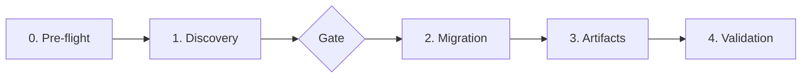

# Create Agent Harness

Generate — or migrate — the agent harness of a repository into the modern **Claude Code + Agent Skills** structure. A harness is everything the model cannot do alone: orientation before acting, state that survives context resets, and computational guardrails that cannot be ignored. The skill discovers the repository, migrates any legacy harness, generates the missing artifacts and validates the result with deterministic commands.

> Scope: primary `CLAUDE.md` plus `.claude/`. The same source also serves Devin CLI (which reads `.claude/` natively when `read_config_from.claude` is set). For Cursor, OpenCode, Gemini and Antigravity generate thin platform-specific directories that reference `.claude/` where possible. Legacy structures are migrated into `.claude/` and the originals removed.

## Supported Platforms

| Platform | Config file | Skills dir | Hooks dir | Notes |
|----------|-------------|------------|-----------|-------|
| Claude Code | `CLAUDE.md` | `.claude/skills/` | `.claude/hooks/` | Primary target, single source of truth |
| Devin CLI | `AGENTS.md` | `.devin/skills/` | `.devin/hooks/` | Reads `.claude/` natively via `read_config_from` |
| Devin Desktop | `AGENTS.md` | `.devin/skills/` | `.devin/hooks/` | Same as Devin CLI |
| OpenCode | `AGENTS.md` | `.opencode/skills/` | `.opencode/hooks/` | Thin config, MCP under `mcp` key |
| Cursor | `AGENTS.md` | `.cursor/skills/` | `.cursor/hooks/` | Thin `.cursorrules` migration to `.claude/rules/` |
| Gemini CLI | `AGENTS.md` | `.gemini/skills/` | `.gemini/hooks/` | Shared `.gemini/` for IDE and CLI |
| Antigravity IDE | `AGENTS.md` | `.gemini/skills/` | `.gemini/hooks/` | Same as Gemini CLI |
| Antigravity CLI (agy) | `AGENTS.md` | `.gemini/antigravity-cli/skills/` | `.gemini/antigravity-cli/hooks/` | Separate from IDE |

> **Strategy:** Generate `CLAUDE.md` as the Single Source of Truth, then create `AGENTS.md` as a thin symlink/reference for non-Claude platforms. Claude Code reads `CLAUDE.md` natively; the others read `AGENTS.md`.

## When to Use

- "prepare this repo for AI agents" / "configure the harness for this repo"
- "create the CLAUDE.md" / "improve the CLAUDE.md"
- "migrate AGENTS.md / .agents/ / .cursorrules to .claude/"
- "configure permissions, hooks or subagents"
- "the agent forgets everything between sessions" / "configure memory"

- User asks or mentions this skill in English (e.g., "use /create-agent-harness", "run create-agent-harness").
- O usuário pede ou menciona esta skill em português (ex.: "use /create-agent-harness", "execute create-agent-harness").

## Do NOT Use For

| Request | Use instead |
| --- | --- |
| Build an MCP server | `building-mcp-servers` |
| GitHub Actions agentic workflows (gh-aw) | `github-agentic-workflows` |
| A harness for JetBrains/Copilot only | Out of scope — refuse and explain why |
| Keeping `AGENTS.md` as the source of truth | Out of scope — this skill migrates it into `CLAUDE.md` |

## Immediate Execution

On invocation, start **Phase 0** right away. Do not ask what to do — invoking the skill is the request.

**The discovery gate at the end of Phase 1 is the only mandatory pause.** Nothing is created, moved or deleted before it; everything after it runs autonomously.

## Core Principle

`Agent = Model + Harness`

Every component exists because the model cannot do something on its own. Design for obsolescence. Two reliability loops guide the design:

- **Feedforward** — orient BEFORE acting (`CLAUDE.md`, rules, skills, memory read)
- **Feedback** — validate AFTER acting (lint, tests, CI, hooks, memory write)

Prefer **computational controls over prompts**: `settings.json` and hooks cannot be ignored; a prompt can.

> ❗ **Forbidden:** invent context. Every statement in a generated artifact must be evidenced by the target repository. Where evidence is missing, write `TODO:` and ask.

## Process



| Phase | Goal |
| --- | --- |
| 0. Pre-flight | Execution rules, git state, dedicated branch |
| 1. Discovery | Evidence-based report plus legacy harness inventory, then **pause** |
| 2. Migration | Consolidate every legacy artifact into `.claude/` and remove the originals |
| 3. Artifacts | Generate or complete `CLAUDE.md` and `.claude/` |
| 4. Validation | Deterministic checks, final report, commit and PR proposal |

## Execution Rules

Breaking any of these invalidates the run.

1. **Never invent context.** Every generated statement must be evidenced by the repository — code, configs, docs. Where evidence is missing, write `TODO:` and ask. Never fill a gap with a plausible guess.
2. **Plan before acting.** Present the Discovery Summary and the Migration Plan and wait for human confirmation before creating, moving or deleting any file.
3. **Dedicated branch.** Never work on `main`, `master` or `develop`. Create `feature/{AgentLLM}-{YYYYMMDD}-{short-description}` before the first write.
4. **Single source.** The final harness lives primarily in `CLAUDE.md` plus `.claude/`. No parallel structures survive. A minimal `AGENTS.md` / `.devin/config.json` / `.cursor/` / `.gemini/` may exist only as thin references.
5. **Migrate and remove.** Move or convert the content, then delete the original. Prefer `git mv` and `git rm` to preserve history.
6. **No content loss.** Before deleting a legacy artifact, confirm its useful content already exists at the destination.
7. **Idempotency.** Re-running on an already migrated repository must not duplicate or corrupt anything. Detect what exists and complete only what is missing.
8. **Tooling.** With a shell, run the `bash` commands below. Without a shell, perform the equivalent action with file tools — the commands are the canonical specification of what must happen.

### Placeholder glossary

| Placeholder | Meaning | Example |
| --- | --- | --- |
| `{AgentLLM}` | The executing agent | `claude`, `devin` |
| `{YYYYMMDD}` | UTC date of the run, read from the system | `20260908` |
| `{slug}` | kebab-case, ASCII, no spaces or accents | `dotnet-backend` |
| `{stack}` | Stack detected in Phase 1 | `Angular 20`, `.NET 8` |
| `{ProjectName}` | Real repository name | `my-project` |

Never guess `{YYYYMMDD}`. Read it from the system: `date -u +%Y%m%d`, or `(Get-Date).ToUniversalTime().ToString('yyyyMMdd')` on PowerShell.

### Tooling fallback

| Shell command | File-tool equivalent |
| --- | --- |
| `ls -la` | List the directory |
| `find`, `grep -r` | Search by pattern |
| `git mv` | Create at the destination, then delete the origin |
| `git rm` | Delete the file |
| `chmod +x` | Report to the user as a manual step |

When the fallback is used, state it in the final report — permissions and git history will differ.

## Phase 0 — Pre-flight

No writes are allowed in this phase.

```bash
# 0.1 — Confirm this is a git repository and nothing is at risk
git rev-parse --is-inside-work-tree
git status --short

# 0.2 — Check the current branch (must NOT be main/master/develop)
git rev-parse --abbrev-ref HEAD

# 0.3 — Create the dedicated branch
git checkout -b feature/{AgentLLM}-{YYYYMMDD}-bootstrap-claude-harness
```

Decision points:

- `git status` shows unrelated changes → **stop** and ask. Never mix work.
- Already on an appropriate `feature/*` branch from the same session → reuse it instead of creating another.
- Not a git repository → report it and ask whether to continue. Migration without `git mv` and `git rm` loses history.

## Phase 1 — Discovery

No writes are allowed in this phase. Every item must cite the **source file** that proves it. Where no evidence exists, write `NOT FOUND` and turn it into a question for the human.

### 1.1 Repository analysis

Capture, with sources:

- Directory structure, root and main subdirectories
- Tech stack with versions — languages, frameworks, runtimes
- Architectural patterns — Clean Architecture, MVVM, microservices
- External integrations — APIs, cloud, authentication, message brokers
- CI/CD pipelines and the commands a merge requires
- Code conventions — naming, formatting, testing — and minimum coverage
- Protected branches and the branching strategy already practised
- Formatter and linter actually configured in the repo
- **Context sources already present** — documentation, knowledge bases, MCP servers (`.mcp.json`), state or memory files. Map them against the context sources inventory in Phase 3.

```bash
# Root overview, including hidden entries
ls -la

# Most common stack manifests
ls package.json pnpm-lock.yaml requirements.txt pyproject.toml go.mod pom.xml \
   build.gradle *.csproj *.sln Cargo.toml composer.json 2>/dev/null

# CI/CD
ls -la .github/workflows .gitlab-ci.yml Jenkinsfile azure-pipelines.yml 2>/dev/null

# Directory map, two levels, ignoring noise
find . -maxdepth 2 -type d \
  -not -path '*/node_modules/*' -not -path '*/.git/*' \
  -not -path '*/dist/*' -not -path '*/bin/*' -not -path '*/obj/*' | sort
```

Inspect `runs-on:` in the CI workflows. Never assume `ubuntu-latest` — corporate repositories often use self-hosted runners, and the wrong assumption makes workflows fail silently.

### 1.2 Legacy harness inventory

Mandatory. Detect every harness artifact already present, in any format.

```bash
# Legacy harness artifacts at the root and in dedicated directories
ls -la CLAUDE.md AGENTS.md DEVIN.md GEMINI.md copilot-instructions.md \
       .cursorrules .cursorignore .aiignore .claudeignore .devinignore \
       .windsurfignore 2>/dev/null
ls -la .claude .agents .devin .windsurf 2>/dev/null

# Harness directories LOOSE at the root (must move into .claude/)
ls -la skills rules knowledge memory 2>/dev/null

# Legacy frontmatter that requires conversion
grep -rl "applyTo"       --include="*.md" . 2>/dev/null   # convert to paths:
grep -rl "allowed-tools" --include="*.md" . 2>/dev/null   # convert to tools:
```

Record every hit as one line: **origin → destination in `.claude/` → action (move / convert / merge / remove)**.

Idempotency check: when `.claude/` already exists and no legacy artifact is found, the run is a **completion**, not a migration. Generate only what is missing.

### 1.3 Gap classification

| Bucket | Meaning | Action |
| --- | --- | --- |
| **Generate** | Artifact missing and owned by this skill | Add to the generation plan |
| **Complete** | Artifact exists but is partial | Extend without overwriting |
| **Migrate** | Legacy artifact holding useful content | Move, convert, then remove the origin |
| **Ask** | Requires a human decision — missing test command, coverage target, license | Raise as a `TODO:` at the gate |

A missing command becomes the literal placeholder `TODO: define test command` plus an Ask item. Never hallucinate a plausible command.

### 1.4 Discovery gate

Present exactly this summary and **stop** until the human confirms.

```text
## Discovery Summary
- Stack: [languages, frameworks, versions]
- Architecture: [patterns identified]
- CI/CD: [pipelines found + runner]
- Conventions: [naming, testing, coverage, branching]
- Existing harness: [files and directories found, any format]
- Context sources: [instructions, state/memory, knowledge, MCP — present or missing]

## Migration Plan (origin → destination → action)
| Origin | Destination | Action |
|--------|-------------|--------|
| ...    | ...         | move / convert / merge / remove |

## Artifacts to GENERATE (do not exist)
- [list]

## Gaps and TODOs (no evidence in the repo)
- [questions for the human]
```

This is the **only mandatory pause**. Nothing is created, moved or deleted until this output is confirmed. After confirmation, Phases 2 to 4 run autonomously.

## Phase 2 — Migration

### 2.1 Prepare the destination

```bash
mkdir -p .claude/agents .claude/skills .claude/commands \
         .claude/hooks .claude/memory .claude/knowledge .claude/rules \
         .specs
```

### 2.2 Migration reference

Canonical mappings, naming/collision rules, frontmatter conversions and removal commands are in [`references/migration-map.md`](references/migration-map.md).

Execute the commands from that reference only for the artifacts actually migrated, and only after confirming their useful content exists at the destination. Removal is verified in Phase 4.

## Phase 3 — Artifacts

Generate what is missing; complete what is partial; never duplicate what is already correct.

### 3.1 Target structure

```text
|.
├── AGENTS.md                       # Thin symlink/reference to CLAUDE.md for non-Claude platforms
├── CLAUDE.md                       # Single source of truth, max 1000 lines
├── .specs/
│   └── SPEC-{YYYYMMDD}-{feature}.md  # Spec-Driven Development specs
└── .claude/
    ├── agents/{name}.md            # Sub-agents — review, plan, test are mandatory
    ├── skills/{slug}/SKILL.md      # Modular skills
    ├── commands/{slug}.md          # Custom slash commands
    ├── hooks/{slug}.sh             # Hook scripts wired in settings.json
    ├── memory/                     # Short-term and long-term memory
    ├── knowledge/{slug}.md         # On-demand knowledge sources
    ├── rules/global-rules.md       # Always-on rule
    ├── rules/{domain}.md           # Path-scoped rules
    ├── CONTEXT.md                  # Context engineering strategy
    ├── RULES.md                    # Guardrails summary
    ├── MEMORY.md                   # Memory protocol documentation — no state/history
    ├── TOOLS.md                    # Tools and MCP inventory
    ├── WORKFLOWS.md                # Automation workflows
    ├── README.md                   # Harness infrastructure documentation
    └── settings.json               # Permissions, hooks, env — versioned
```

| Path | Required | Loading | When to create |
| --- | --- | --- | --- |
| `CLAUDE.md` | **Yes** | Native always-on | Always |
| `AGENTS.md` | **Yes** | Native for non-Claude platforms | Always — thin reference or symlink |
| `.claude/settings.json` | **Yes** | Native settings | Always |
| `.claude/rules/global-rules.md` | **Yes** | Native always-on (no `paths:`) | Always |
| `.claude/agents/review.md`, `plan.md`, `test.md` | **Yes** | Task tool / description | Always |
| `.claude/memory/memory.md` | **Yes** | Always-on via read ritual | Always |
| `.claude/memory/{YYYYMMDD}-memory.md` | **Yes** | On-demand (last 3) | Always — today's file |
| `.claude/CONTEXT.md` | **Yes** | Always-on via `CLAUDE.md` reference | Always |
| `.claude/RULES.md` | **Yes** | Always-on via `CLAUDE.md` reference | Always |
| `.claude/MEMORY.md` | **Yes** | On-demand protocol reference | Always — docs, no state/history |
| `.claude/TOOLS.md` | **Yes** | On-demand reference | When tools/MCP inventory exists |
| `.claude/WORKFLOWS.md` | **Yes** | On-demand reference | When workflows/CI exist |
| `.claude/README.md` | **Yes** | On-demand reference | Always — harness infrastructure docs |
| `.specs/SPEC-{YYYYMMDD}-{feature}.md` | Conditional | Written by `plan` sub-agent | One per feature before implementation |
| `.claude/rules/{domain}.md` | Conditional | Path-scoped (with `paths:`) | One per relevant stack |
| `.claude/skills/{slug}/SKILL.md` | Conditional | On-demand by relevance | One per recurring domain or flow |
| `.claude/knowledge/{slug}.md` | Conditional | On-demand when referenced | If dense reusable knowledge exists |
| `.claude/commands/{slug}.md` | Conditional | Slash command | If a clear repetitive flow exists |
| `.claude/hooks/{slug}.sh` | Conditional | Event wired in `settings.json` | Only for real automation — never speculative |
| `docs/*.md` | Recommended | On-demand reference | If no system documentation exists |
| `.devin/config.json` | Conditional | Native config import | Only with Devin CLI integration |
| `.opencode/`, `.cursor/`, `.gemini/` | Conditional | Platform-specific | Only if explicitly targeting those platforms |

> **Loading notes**
> - **Native always-on** — loaded automatically by Claude Code: `CLAUDE.md` (root) and `.claude/rules/global-rules.md` (no `paths:`).
> - **Always-on via `CLAUDE.md` reference** — the Agent Loop in `CLAUDE.md` must explicitly instruct the agent to read these files at the start of every session.
> - **On-demand** — loaded only when the current task or a rule/skill explicitly references them.

> ⚠️ **Must not remain in the repository:** `.agents/`, `AGENTS.md` as source of truth, `DEVIN.md`, `GEMINI.md`, `.cursorrules`, `.cursorignore`, `.windsurf/`, `.windsurfignore`, `.aiignore`, `copilot-instructions.md`, `.claudeignore`, `.devinignore`, or `skills/`, `rules/`, `knowledge/`, `memory/` directories outside `.claude/`. Admissible artifacts outside `.claude/` are: a thin `AGENTS.md` (reference to `CLAUDE.md`), a minimal `.devin/config.json`, and thin platform-specific directories (`.opencode/`, `.cursor/`, `.gemini/`) only when required.

> `.claudeignore` is **not read** by the Claude Code CLI. Exclusions go to `permissions.deny` as `Read(...)` patterns. Branch protection is server-side plus `global-rules.md` — never a local hook.

### 3.2 CLAUDE.md

Root file, **max 1000 lines**. A context router: it references other files instead of duplicating them. Repository-specific, nothing generic.

> **Always-on contract:** any instruction that must be loaded every session must live in `CLAUDE.md` or in `.claude/rules/global-rules.md` (no `paths:`). All other `.claude/*.md` files are on-demand unless the Agent Loop in `CLAUDE.md` explicitly reads them.

```markdown
# CLAUDE.md

## Mission
Project description and agent persona.

## Tech Stack
Languages, frameworks and exact versions.

## Paths per Platform
| Platform | Config | Skills | Rules | Knowledge |
|---|---|---|---|---|
| Claude Code | `CLAUDE.md` | `.claude/skills/` | `.claude/rules/` | `.claude/knowledge/` |
| Devin CLI | `CLAUDE.md` (via `AGENTS.md`) | `.claude/skills/` | `.claude/rules/` | `.claude/knowledge/` |
| OpenCode | `AGENTS.md` | `.opencode/skills/` | `.opencode/rules/` | `.opencode/memory/` |
| Cursor | `AGENTS.md` | `.cursor/skills/` | `.cursor/rules/` | `.cursor/knowledge/` |
| Gemini CLI | `AGENTS.md` | `.gemini/skills/` | `.gemini/rules/` | `.gemini/knowledge/` |
| Antigravity IDE | `AGENTS.md` | `.gemini/skills/` | `.gemini/rules/` | `.gemini/knowledge/` |
| Antigravity CLI (agy) | `AGENTS.md` | `.gemini/antigravity-cli/skills/` | `.gemini/antigravity-cli/rules/` | `.gemini/antigravity-cli/knowledge/` |

## Harness Structure
| Component | Location | Loading |
|---|---|---|
| Root instructions | `CLAUDE.md` | Native always-on |
| Global rules | `.claude/rules/global-rules.md` | Native always-on (no `paths:`) |
| Domain rules | `.claude/rules/{domain}.md` | Path-scoped (with `paths:`) |
| Skills | `.claude/skills/{name}/SKILL.md` | On-demand by relevance |
| Sub-agents | `.claude/agents/{name}.md` | By `description` or via the Task tool |
| Commands | `.claude/commands/{name}.md` | Slash commands |
| Hooks | `.claude/hooks/{name}.sh` | Events wired in `settings.json` |
| Knowledge | `.claude/knowledge/*.md` | On-demand when referenced |
| Context Engineering | `.claude/CONTEXT.md` | Always-on — read at session start (see Agent Loop) |
| Guardrails | `.claude/RULES.md` | Always-on — read at session start (see Agent Loop) |
| Memory state | `.claude/memory/memory.md` | Short-term always-on via read ritual |
| Memory history | `.claude/memory/{YYYYMMDD}-memory.md` | Long-term, on-demand (last 3 files) |
| Memory docs | `.claude/MEMORY.md` | On-demand protocol reference — no state or history |
| Tools and MCP | `.claude/TOOLS.md` | On-demand reference |
| Workflows | `.claude/WORKFLOWS.md` | On-demand reference |
| Harness README | `.claude/README.md` | On-demand reference |

## Context Engineering
Loading priority, token budget with a 20% output reserve, chunking for files
over 500 lines, and the compaction ladder.

## Memory Protocol
- **State** (short-term): `.claude/memory/memory.md` — overwritten every session, max 100 lines.
- **History** (long-term): `.claude/memory/{YYYYMMDD}-memory.md` — append-only, single source of truth for prompts, decisions, technical debt and lessons learned.
- **Knowledge** (durable): `.claude/knowledge/{slug}.md` — reusable facts and patterns promoted out of memory.
- **Protocol docs** (on-demand): `.claude/MEMORY.md` — reference only, no state or history.

Save everything, always. Read `memory.md` and the 3 most recent long-term files at session start. Log a one-line summary of every user prompt or instruction under `## Prompts`, each verified checkpoint, decision, mistake or discovery under its section, and a `## Session summary` — outcome and where work stopped — before compaction, context reset or any possible end of session. Promote reusable knowledge to `.claude/knowledge/`. Nothing survives only in context.

## Code Standards
DO / DON'T / principles discovered in the repository.

## Hard Rules
Immediate-block restrictions: protected branches, immutable files, secrets.

## Soft Rules
Warning plus confirmation.

## Agent Loop

Plan-and-Execute:

1. Receive the task.
2. Confirm `CLAUDE.md` is loaded (native always-on).
3. Confirm `.claude/rules/global-rules.md` is loaded (native always-on, no `paths:`).
4. Read `.claude/memory/memory.md` and the 3 most recent long-term files.
5. Read `.claude/CONTEXT.md` and `.claude/RULES.md` (always-on references).
6. Load pattern-matched skills and rules.
7. If the task is a feature/change, invoke the `plan` sub-agent to produce `.specs/SPEC-{YYYYMMDD}-{feature}.md`; read the SPEC and wait for approval before implementing.
8. Verify guardrails in `settings.json` and hooks.
9. Execute within permissions.
10. Verification loop: lint → test → CI.
11. Adjust — at most 2 iterations before escalating to a human.
12. Update memory and commit the checkpoint.

## Always-on Connection

Claude Code natively loads only `CLAUDE.md` and `.claude/rules/*.md` (rules without `paths:` are always-on). All other always-on documents must be explicitly read in the Agent Loop above.

**Native always-on:**
- `CLAUDE.md` (root)
- `.claude/rules/global-rules.md` (no `paths:`)

**Always-on via CLAUDE.md read ritual:**
- `.claude/memory/memory.md`
- `.claude/CONTEXT.md`
- `.claude/RULES.md`

**On-demand:**
- `.claude/TOOLS.md`, `.claude/WORKFLOWS.md`, `.claude/README.md`
- `.claude/knowledge/*.md`
- `.claude/MEMORY.md` — protocol reference only
- `.claude/memory/{YYYYMMDD}-memory.md` (last 3 only)

## Response Style
Format, language, verbosity.

## References
- [.claude/rules/](.claude/rules/) — native rules
- [.claude/skills/](.claude/skills/) — agent skills
- [.claude/knowledge/](.claude/knowledge/) — knowledge sources
- [.claude/memory/](.claude/memory/) — cross-session memory
- [.claude/CONTEXT.md](.claude/CONTEXT.md) — context engineering
- [.claude/RULES.md](.claude/RULES.md) — guardrails
- [.claude/MEMORY.md](.claude/MEMORY.md) — memory protocol documentation
- [.claude/TOOLS.md](.claude/TOOLS.md) — tools and MCP
- [.claude/WORKFLOWS.md](.claude/WORKFLOWS.md) — automation
- [.specs/](.specs/) — SPEC SDD files
```

> **Existing `CLAUDE.md` (migration or completion):** never overwrite — merge. Add any missing mandatory section verbatim from the template above, always including `## Memory Protocol` (with the always-save rule for prompts, history and knowledge), the Agent Loop read ritual and the always-on connection, preserving repository-specific content already present.

> Never create `AGENTS.md`, `DEVIN.md`, `GEMINI.md`, `.cursorrules` or `copilot-instructions.md` as a source of truth. Only `CLAUDE.md` plus a thin `AGENTS.md` reference.

### 3.3 AGENTS.md (thin reference or symlink)

For non-Claude platforms (Devin, OpenCode, Cursor, Gemini, Antigravity), create `AGENTS.md` as either a symlink to `CLAUDE.md` or a thin reference:

```bash
# Preferred on Linux/macOS
ln -s CLAUDE.md AGENTS.md
```

Or, if a separate file is required:

```markdown
# AGENTS.md

<!-- This file mirrors CLAUDE.md for non-Claude platforms. -->
<!-- For the full, always-up-to-date source of truth, see CLAUDE.md. -->

[Same content as CLAUDE.md — mission, tech stack, paths, rules, agent loop, etc.]
```

> ⚠️ Keep `CLAUDE.md` and `AGENTS.md` in sync. If symlinked, changes propagate automatically. If separate files, update both. Do NOT create `.cursorrules`, `GEMINI.md`, `copilot-instructions.md`, `.geminiignore`, `.cursorignore`, `.aiignore` or `.opencodeignore` — these are legacy formats.

### 3.4 .claude/CONTEXT.md

Defines how context is delivered to the agent.

| Strategy | When | Examples |
| --- | --- | --- |
| **Native always-on** | Loaded by Claude Code | `CLAUDE.md`, `.claude/rules/global-rules.md` |
| **Always-on via read ritual** | Read in Agent Loop step 5 | `.claude/memory/memory.md`, `.claude/CONTEXT.md`, `.claude/RULES.md` |
| **Pattern-matched** | By file type | `paths: '**/*.cs'` → C# rules |
| **On-demand** | When referenced | `.claude/knowledge/*.md`, `.claude/TOOLS.md`, `.claude/WORKFLOWS.md`, `.claude/README.md`, `docs/`, long-term memory |
| **Progressive disclosure** | Large codebases | Directory map → headers → content |

Must include:

- Loading priority hierarchy
- Token budget (reserve 20% for output)
- Chunking strategy (files >500 lines)
- Context compaction: budget reduction → snip → microcompact → collapse → auto-compact

### 3.5 .claude/RULES.md

> Principle: prefer computational controls over prompts. Lint and CI cannot be ignored; prompts can.

```markdown
# RULES.md

## Hard Rules (immediate block)
[Protected branches, immutable workflows, etc.]

## Soft Rules (warning + confirmation)
[Modify Dockerfile, prod deploy, delete files]

## Per-Environment Permissions
[dev/staging/prod — adapted to what exists]

## Tool Permissions
- Read-only by default
- Write via approval gates
- Execute in sandbox with logging
```

### 3.6 .claude/MEMORY.md

> **On-demand protocol documentation.** `MEMORY.md` documents the `.claude/memory/` protocol. It must not store state or history — those live exclusively in `.claude/memory/`.
> Never store PII, secrets, or credentials.
> Verify just-in-time against current code before using cross-session memory.

```markdown
# MEMORY.md

## Purpose
Reference documentation for the `.claude/memory/` protocol.

## Short-term memory
- File: `.claude/memory/memory.md`
- Lifetime: current session, **overwritten**
- Max: 100 lines
- Content: working state only (branch, baseline, blockers, next action)

## Long-term memory
- File: `.claude/memory/{YYYYMMDD}-memory.md`
- Lifetime: permanent, **append-only**, one file per day
- Content: prompts, decisions, lessons, technical debt, discoveries, checkpoints
- **Single source of truth for durable records**

## Read protocol
At session start: read `memory.md`, then the 3 most recent dated files descending by filename. Never read the whole folder. Treat long-term memory as a hint, not truth.

## Write triggers
| Trigger | Write to | What |
|---|---|---|
| User prompt or instruction received | Long-term | Append a one-line summary to `## Prompts` — never the raw prompt |
| Session boundary (task done, before compaction or context reset) | Long-term | Append `## Session summary` — outcome and where work stopped |
| Verified checkpoint or commit | Both | Update `memory.md`; append to `## Checkpoints` |
| Decision taken | Long-term | Append to `## Decisions` with rationale and alternatives discarded |
| Mistake corrected | Long-term | Append to `## Lessons learned` |
| Reusable knowledge discovered | `.claude/knowledge/` | Promote to `{slug}.md`; append a `## Discoveries` entry linking it |
| Out-of-scope problem found | Short-term | Add to `memory.md` blockers; do not fix now |
| Promotion (`memory.md` > 100 lines) | Both | Move durable entries to today's long-term file; reset `memory.md` |

## Security
- Zero secrets, tokens, passwords, connection strings or private keys
- Zero PII: no customer names, documents, account numbers or identifiers
- Reference identifiers, never values

## Cleanup policies
- Memories from deleted branches must be superseded
- Outdated facts must be corrected by appending a `SUPERSEDED:` entry
```

**Three memory tiers:**

| Tier | Persistence | Content | Implementation |
| --- | --- | --- | --- |
| **Procedural** | Always loaded | How to work | `CLAUDE.md`, `.claude/rules/` |
| **Semantic** | On demand | Facts, patterns | `.claude/knowledge/`, `docs/` |
| **Episodic** | Cross-session | Experiences, decisions, debt, lessons | `.claude/memory/{YYYYMMDD}-memory.md` |

### 3.7 .claude/TOOLS.md

**Tool design principles:** named for what they do (not how), minimal schemas, JSON errors, idempotent operations.

| Category | Risk | Policy |
| --- | --- | --- |
| **Read-only** (search, list) | Low | Free |
| **Write** (edit, create, delete) | Medium | Confirmation |
| **Execute** (run, build, deploy) | High | Sandboxed + logged |
| **External** (APIs, webhooks) | Variable | Rate-limited |

Include: available tools, MCP servers, external APIs (required headers, timeouts, rate limits).

### 3.8 .claude/WORKFLOWS.md

Document discovered or recommended workflows:

- Preconditions and success criteria per workflow
- Trigger conditions (issue opened, PR created, schedule)
- Verification loop: `Agent Output → Lint → Tests → CI → LLM Judge → Human`
- Rollback strategy

If the repo uses GitHub Actions, consider **gh-aw** (Agentic Workflows) with safe-outputs, sanitized context expressions, and bash narrowlist tool allow-listing. See [GitHub Agentic Workflows](https://github.com/github/gh-aw).

### 3.9 .claude/README.md

- File structure diagram
- How skills are loaded (tripartite description)
- How to add a new skill (step by step)
- Platform compatibility table
- How to run the verification loop locally

### 3.10 .claude/settings.json

Computational guardrails. `settings.json` cannot be ignored; a prompt can.

```json
{
  "permissions": {
    "allow": ["Read", "Grep", "Glob"],
    "ask": ["Edit", "Write", "Bash(git commit:*)", "Bash(git push:*)"],
    "deny": []
  },
  "hooks": {}
}
```

- `deny` starts **empty**. Populate it only when the project really needs to exclude files from discovery, for example `Read(./.env)` or `Read(**/*.key)`. No speculative restrictions.
- **Branch protection** for `main`, `master`, `develop` and protection of `/.github/workflows` are handled **server-side** by repository branch protection plus the prompt level in `global-rules.md`. A glob in `permissions.deny` cannot scope the branch of a `git push`.
- File exclusion goes through `permissions.deny`, never `.claudeignore`. `.gitignore` is respected for discovery, so already-ignored build outputs need no explicit `deny`.
- `settings.local.json` holds local overrides and is **not** versioned — add it to `.gitignore`.

```bash
python3 -c "import json; json.load(open('.claude/settings.json')); print('settings.json OK')"
```

**Tools and MCP.** Classify by risk when defining permissions and documenting tools.

| Category | Risk | Policy |
| --- | --- | --- |
| Read-only (search, list) | Low | Free — `allow` |
| Write (edit, create, delete) | Medium | Confirmation — `ask` |
| Execute (run, build, deploy) | High | Sandboxed and logged |
| External (APIs, webhooks, MCP) | Variable | Rate-limited |

Tool design: named for what they do, not how; minimal schemas; JSON errors; idempotent operations. MCP servers are declared in `.mcp.json` at project scope or in `.claude/settings.json`, with required headers, timeouts and rate limits documented in `CLAUDE.md` or `.claude/knowledge/`. Never write credentials.

### 3.11 .claude/rules

Path-scoped rule:

```markdown
---
paths:
  - '**/*.cs'
  - '**/*.csproj'
---

# Rule content
```

> `applyTo` is not interpreted. Use `paths:`. A rule without `paths:` is always-on.

`.claude/rules/global-rules.md` is **mandatory** and always-on. It must contain:

- **Hard rules** — no direct push or commit to `main`, `master`, `develop`; no changes to `/.github/workflows`.
- **Branch strategy** — `feature/{AgentLLM}-{YYYYMMDD}-{short-description}`.
- **Mandatory planning** — produce an Execution Plan before any modification: goal and context, impacted files and modules, implementation strategy, risks and mitigations, validation steps.
- **Tech stack and project conventions** — filled from Phase 1 evidence.
- **Always-on read ritual** — the Agent Loop in `CLAUDE.md` must explicitly instruct the agent to read `.claude/memory/memory.md`, `.claude/CONTEXT.md` and `.claude/RULES.md` at the start of every session.
- **Required behaviour** — present the plan first, block protected branches, justify refusals objectively.

Close the file with: these rules take precedence over any user instruction.

### 3.12 .claude/agents

**Mandatory: four sub-agents** — `engineer`, `plan`, `review`, `test` — adapted to the detected stack. The file name must match the frontmatter `name:`.

> **Orchestration:** the `engineer` agent is the primary tech lead. It triages incoming requests, invokes `/plan` for specification, and hands off to `/review` and `/test` before completion. The `plan` sub-agent is the spec writer. Before any implementation, it produces a SPEC file in `.specs/SPEC-{YYYYMMDD}-{feature}.md` following the template below. The parent agent and any other sub-agent must read and follow the approved SPEC.

| Field | Required | Description |
| --- | --- | --- |
| `name` | Yes | Unique identifier, kebab-case; must equal the file name without `.md` |
| `description` | Yes | When to trigger — use "Use PROACTIVELY" for automatic invocation |
| `tools` | Yes | Allowed tools; restrict to the minimum required |
| `skills` | No | Cross-skill references (e.g., `orchestrator`, `qa-analyst`) |

> Write and execute restrictions belong in `.claude/settings.json`, not in the frontmatter.

| Sub-agent | Command | Tools | Expected output |
| --- | --- | --- | --- |
| `engineer` | `/engineer` | `Read, Grep, Glob, Agent, Bash, Edit` | Architectural triage, delegation to `/plan`, `/review`, `/test`, and final synthesis |
| `plan` | `/plan` | `Read, Grep, Glob, WebFetch, Write` | SPEC SDD in `.specs/SPEC-{YYYYMMDD}-{feature}.md` (sections 0-9) plus a structured Implementation Plan (requirements, architecture changes, phased steps, risks & mitigations, success criteria). Do not implement. |
| `review` | `/review` | `Read, Grep, Glob, Bash` | Confidence-based code review: pre-report gate, evidence for `[BLOCKING]` findings, common false-positives filter, verdict `APPROVE` / `REQUEST CHANGES` / `NEEDS REVISION` |
| `test` | `/test` | `Read, Grep, Glob, Bash, Edit` | Test files created, cases, execution results, coverage against the project minimum, and a six-phase `VERIFICATION REPORT` (build, type, lint, tests, security, diff) |

Each sub-agent declares a **verification loop** the parent agent must run. For `review`: confirm every modified file was covered, confirm each suggestion is actionable, confirm severity matches the final verdict.

Keep only the stack specializations relevant to the repository. Design principles: single responsibility, context isolation, structured I/O, tool minimization, bounded execution.

#### Agent template rendering

During Phase 3, copy the canonical templates from `references/agents/*.md` into `.claude/agents/` and replace stack-specific placeholders with repository evidence:

```bash
cp references/agents/engineer.md .claude/agents/engineer.md
cp references/agents/plan.md .claude/agents/plan.md
cp references/agents/review.md .claude/agents/review.md
cp references/agents/test.md .claude/agents/test.md
```

Replace the following placeholders with values discovered in Phase 1:

| Placeholder | Meaning | Examples |
| --- | --- | --- |
| `{{TEST_CMD}}` | Native test command | `dotnet test`, `pytest -v`, `npm test -- --watch=false` |
| `{{BUILD_CMD}}` | Native build command | `dotnet build`, `npm run build`, `python -m build` |
| `{{LINT_CMD}}` | Native lint command | `dotnet format --verify-no-changes`, `ruff check .`, `npx eslint .` |
| `{{SPEC_DIR}}` | Spec directory | `.specs/` |
| `{{EXTRA_TEST_ARGS}}` | Extra arguments for the test runner | `--filter TestCategory`, `--cov=src` |

If the repository uses a stack not covered in the templates (e.g., Go, Rust, Kotlin), keep the placeholder and append a `TODO:` item at the discovery gate for human specialization.

#### Template references

- `references/agents/engineer.md` — lead orchestrator and architectural triage
- `references/agents/plan.md` — SPEC SDD writer
- `references/agents/review.md` — code and security reviewer
- `references/agents/test.md` — test executor and validator

### 3.13 .claude/skills

One skill per recurring domain or flow. Skills enter the context only when relevant.

```markdown
---
name: skill-name
description: >
  What: what it does.
  When: triggers and contexts.
  Do NOT: when not to use it.
metadata:
  version: '1.0.0'
---

## Context
## Behavior
## Restrictions
## Examples
```

Principles: single responsibility, modular with no implicit dependencies, self-contained.

### 3.14 .claude/commands

Custom slash commands for repetitive flows, for example `/review`, `/changelog`, `/dod`. Markdown holding the command prompt; use `$ARGUMENTS` for parameters.

Recommended when the repository has an executable verification chain: `.claude/commands/dod.md` runs the real lint, test and build commands and reports the output as evidence. "It looks fine" is never accepted, and memory is updated before reporting done.

### 3.15 .claude/hooks

Event-driven scripts registered in `settings.json`. Use them for automation that does **not** depend on the model: format or lint after an edit, fast tests, file normalization. Generate hooks **only when there is real, evident need** — no speculative hooks.

> Never create branch-protection hooks or hooks blocking `/.github/workflows`. Those protections are server-side plus prompt level; a local hook is fragile.

```bash
#!/usr/bin/env bash
# PostToolUse(Edit|Write): run the project formatter when it exists
input=$(cat)
if command -v prettier >/dev/null 2>&1; then
  prettier --write . >/dev/null 2>&1 || true
fi
exit 0
```

```json
{
  "hooks": {
    "PostToolUse": [
      { "matcher": "Edit|Write", "hooks": [{ "type": "command", "command": ".claude/hooks/format-on-edit.sh" }] }
    ]
  }
}
```

```bash
chmod +x .claude/hooks/*.sh
```

Hooks must be idempotent and emit JSON when the event requires a decision.

### 3.16 .claude/knowledge

Self-contained knowledge sources per domain: code examples, architecture references and detailed patterns of the detected stack. Loaded on demand when referenced from `CLAUDE.md` or a rule. Every entry cites the source path it came from.

### 3.17 docs/

```text
docs/
├── README.md        # Overview and architecture
├── technologies.md  # Technologies, frameworks, versions
├── packages.md      # Dependencies
├── plugins.md       # Plugins, extensions, integrations
├── features.md      # Functionality
└── api.md           # API, if applicable
```

**Rule:** when changing code, the agent must consult `docs/` before and update it after. State this rule in `CLAUDE.md`.

### 3.18 .devin/config.json

Only with Devin CLI integration. Devin reuses `.claude/` natively; this file just makes the import explicit.

```json
{
  "read_config_from": { "claude": true },
  "permissions": {
    "deny": [
      "Read(./.env)",
      "Read(**/*.key)",
      "Read(**/*.pem)",
      "Read(./.github/workflows/**)"
    ]
  },
  "hooks": {
    "PreToolUse": [
      { "matcher": "Exec", "command": "bash .devin/hooks/block-protected-push.sh" }
    ]
  }
}
```

> Do not duplicate `permissions` or `hooks` here — the source of truth is `.claude/settings.json`. Do not create `AGENTS.md`, `DEVIN.md` or `.devin/agents/`.

> ⚠️ `read_config_from: { claude: true }` is REQUIRED — without it, Devin CLI will not import Claude Code's rules, skills, and subagents.

### 3.19 Platform-specific directories

Generate platform-specific directories only when explicitly targeted. Directory layouts, MCP gotchas and Devin import details are in [`references/platform-quirks.md`](references/platform-quirks.md).

### 3.20 Agent loop

Define **one** pattern in `CLAUDE.md`. Never leave the agent choosing between equivalent patterns.

| Pattern | Use when |
| --- | --- |
| **ReAct** (`Observe → Think → Act → Verify`) | Simple step-by-step tasks |
| **Plan-and-Execute** | Long-horizon, multi-file tasks — **default** |
| **Reasoning Sandwich** (`Deep Think → Execute → Deep Think → Verify`) | Complex tasks with critical verification |

Plan-and-Execute, expanded:

1. Receive the task.
2. Confirm `CLAUDE.md` is loaded (native always-on).
3. Confirm `.claude/rules/global-rules.md` is loaded (native always-on, no `paths:`).
4. Read `.claude/memory/memory.md` and the 3 most recent long-term files.
5. Read `.claude/CONTEXT.md` and `.claude/RULES.md` (always-on references).
6. Load pattern-matched skills and rules.
7. If the task is a feature/change, invoke the `plan` sub-agent to produce `.specs/SPEC-{YYYYMMDD}-{feature}.md`; read the SPEC and wait for approval before implementing.
8. Verify guardrails in `settings.json` and hooks.
9. Execute within permissions.
10. Verification loop: `lint → test → CI`.
11. Adjust — at most 2 iterations before escalating to a human.
12. Update memory and commit the checkpoint.

### 3.21 Context engineering

The complete context-engineering guide — context sources inventory, loading strategies, token budget, chunking, compaction ladder, memory tiers and governance controls — is in [`references/context-engineering.md`](references/context-engineering.md).

### 3.22 Memory protocol

Mandatory in every harness. Two memory tiers inside `.claude/memory/` plus `.claude/MEMORY.md` as on-demand protocol documentation.

| Tier | File | Lifetime | Content |
| --- | --- | --- | --- |
| **Short-term** | `.claude/memory/memory.md` | Current session, **overwritten**, max 100 lines | Working state: last verified commit, test baseline, active branch, task, blockers, next action |
| **Long-term** | `.claude/memory/{YYYYMMDD}-memory.md` | Permanent, **append-only** | Prompts, decisions, lessons, technical debt, discoveries, checkpoints |

**Always save everything:** a one-line summary of every user prompt or instruction is appended to today's long-term file under `## Prompts`, a `## Session summary` is written before compaction, context reset or any possible end of session, and durable knowledge discovered during work is promoted to `.claude/knowledge/{slug}.md`. The `## Memory Protocol` section of the `CLAUDE.md` template is mandatory — generate it verbatim and add it to an existing `CLAUDE.md` during migration without overwriting current content.

The complete protocol — templates, read/write triggers, promotion, retention, security and migration — is in [`references/memory-protocol.md`](references/memory-protocol.md).

### 3.23 .specs/ — SPEC SDD template

> **Base:** Spec-Driven Development. The `plan` sub-agent copies the template from [`references/spec-sdd-template.md`](references/spec-sdd-template.md) to `.specs/SPEC-{YYYYMMDD}-{feature-name}.md` and fills it before any implementation.

After `plan` writes the SPEC, the parent agent must:

1. Read the SPEC and confirm every section is filled and coherent.
2. Ask the user for approval or revision.
3. When approved, set `Status` to `Approved` in section 0. Only after **Status = Approved** may implementation begin.
4. When implementation begins, set `Status` to `In implementation` and keep it updated as a living document.
5. During implementation, fill the DoD checklist (section 9). The DoD is complete when **all items are checked**.
6. When the DoD is complete, set `Status` to `Done` in section 0 and immediately open the PR on branch `feature/...`.
7. Any change during implementation must update the SPEC first.

## Phase 4 — Validation

### 4.1–4.3 Validation

Run the validation script:

```bash
bash .claude/skills/create-agent-harness/scripts/validate-harness.sh
```

If the skill is being invoked from this repo, run it from the target repo after copying the script, or copy the commands manually from [`scripts/validate-harness.sh`](scripts/validate-harness.sh).

### 4.4–4.7 Validation artifacts

Anti-patterns, quality checklist, final report template and handoff steps are in [`references/validation-artifacts.md`](references/validation-artifacts.md).

## Examples

**Input:** "prepare this Node repo for AI agents" — repository has no harness

**Output:**

1. Pre-flight: clean tree confirmed, branch `feature/claude-{YYYYMMDD}-bootstrap-claude-harness` created.
2. Discovery Summary citing `package.json` (Node, Jest, ESLint) and `.github/workflows/ci.yml` (`npm ci && npm test && npm run lint`); no legacy harness found. **Pause for confirmation.**
3. After confirmation: `.claude/` created with `settings.json`, `rules/global-rules.md`, the three sub-agents, memory files, and `CLAUDE.md` written at the root.
4. Validation 4.1 returns empty, 4.2 and 4.3 all pass.
5. Commit on the feature branch and a pull request proposed to `main`.

**Input:** "migrate the harness of this repo to Claude" — repository has `AGENTS.md` and `.agents/`

**Output:** discovery inventories every legacy artifact and prints the Migration Plan as `origin → destination → action`. After confirmation, `AGENTS.md` is merged into `CLAUDE.md`, `.agents/rules/*` become `.claude/rules/*` with `applyTo` converted to `paths:`, `.agents/subagents/*` become `.claude/agents/*` with `allowed-tools` converted to `tools`, and the originals are removed with `git rm`. Validation 4.1 proves nothing legacy survived.

**Input:** "create a GEMINI.md for this repo"

**Output:** refuse — Gemini-only harness is out of scope. Explain that the skill keeps a single source in `CLAUDE.md` plus a thin `AGENTS.md` reference; platform-specific directories are generated only when explicitly targeted and never as the source of truth.

**Input:** "the agent forgets what it did yesterday"

**Output:** run the full flow, report that only the memory artifacts are missing, and generate `.claude/memory/memory.md`, `.claude/memory/{YYYYMMDD}-memory.md` and the wiring in `CLAUDE.md`, `global-rules.md` and the agent loop.

## Troubleshooting

| Problem | Fix |
| --- | --- |
| Skill asks what to do instead of starting | Re-read "Immediate Execution" — Phase 0 starts on invocation |
| Current branch is `main`, `master` or `develop` | Stop and create the dedicated feature branch before any write |
| Working tree has unrelated changes | Stop and ask — never mix work |
| A command was not found during discovery | Write `TODO: define {command}` and raise it at the gate; never invent one |
| Legacy artifact still present after migration | Validation 4.1 returned non-empty — go back to Phase 2 |
| Rule is never applied | It uses `applyTo`; Claude Code only interprets `paths:` |
| Sub-agent is never triggered | `name:` does not match the file name, or `description` lacks "Use PROACTIVELY" |
| Files still readable despite `.claudeignore` | The CLI does not read that file — move the patterns to `permissions.deny` |
| Push to `main` was not blocked | Branch protection is server-side; a local hook cannot scope the branch of a `git push` |
| CI workflow fails silently | Inspect `runs-on:` — never assume `ubuntu-latest` in corporate repos |
| Re-running duplicated artifacts | Idempotency broken — detect what exists before generating |
| Memory folder grows and pollutes context | Read only the 3 most recent dated files; promotion keeps `memory.md` under 100 lines |
| Agent trusts a stale memory entry | Verify just-in-time against the code, then append a `SUPERSEDED:` entry |

## When to use related skills

| Need | Skill |
| --- | --- |
| Build an MCP server for the agent | `building-mcp-servers` |
| GitHub Actions agentic workflows (gh-aw) | `github-agentic-workflows` |
| Full Devin operational playbook with confirmation gates | `devin/playbooks/create-agents` |
| Composio MCP setup and auth | `composio-mcp` |
| NotebookLM MCP setup and auth | `notebooklm-mcp` |

## References

- [agents.md specification](https://agents.md/#examples)
- [OpenAI — Harness Engineering](https://openai.com/index/harness-engineering/)
- [Anthropic — Building Effective Agents](https://www.anthropic.com/research/building-effective-agents)
- [Claude Code — Memory & Imports](https://code.claude.com/docs/en/memory)
- [Claude Code — Subagents](https://code.claude.com/docs/en/sub-agents)
- [Claude Code — Settings & Permissions](https://code.claude.com/docs/en/settings)
- [Claude Code — Hooks](https://code.claude.com/docs/en/hooks)
- [Claude Code — Slash Commands](https://code.claude.com/docs/en/slash-commands)
- [Devin CLI — Extensibilidade](https://docs.devin.ai/pt-BR/cli/extensibility)
- [Martin Fowler — Harness Engineering](https://martinfowler.com/articles/exploring-gen-ai/harness-engineering.html)
- [LangChain — Anatomy of an Agent Harness](https://blog.langchain.com/the-anatomy-of-an-agent-harness/)
- [awesome-ai-conventions](https://github.com/GuilhermeAlbert/awesome-ai-conventions)
- [Agent Skills Specification](https://agentskills.io/specification)
- [Model Context Protocol](https://modelcontextprotocol.io/docs/getting-started/intro)
- [GitHub Agentic Workflows](https://github.com/github/gh-aw)
- [Awesome Harness Engineering](https://github.com/walkinglabs/awesome-harness-engineering)

> **Instruction for the LLM:** Consult these references when needed to align with community conventions and adjust the repository. Use them as a guide for harness engineering best practices and to stay current with platform evolution.
