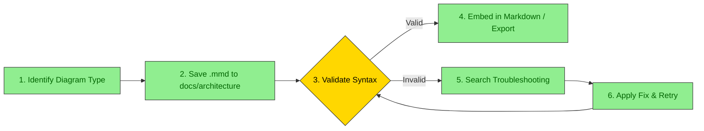

# Mermaid Architecture Diagrams

Create structured, high-contrast, production-ready Mermaid architecture diagrams, workflows, and system design documentation. Native diagrams render directly in Markdown viewers (GitHub, GitLab, Obsidian, wikis) with optional image exports (PNG/SVG) generated via Mermaid CLI (`mmdc` / `npx @mermaid-js/mermaid-cli`).

## 📁 Storage Location (`docs/architecture/`)

All generated architecture diagrams, source `.mmd` files, exported images, and system design documents **must be stored in `docs/architecture/`**, consistent with the `drawio-architecture` convention:

```text
docs/architecture/
├── system-architecture.md             # Architecture documentation with embedded Mermaid blocks
├── <name>_<type>_<title>.mmd          # Source Mermaid definitions
├── <name>_<type>_<title>.png          # Optional exported raster image
└── <name>_<type>_<title>.svg          # Optional exported vector image
```

Ensure the directory exists before saving:
```bash
mkdir -p docs/architecture
```

## When to Use

- The user asks for an **architecture diagram**, **system structure**, **component overview**, **C4 model**, **microservices topology**, or **data flow**.
- Documenting **API interactions**, **service call sequences**, **authentication flows**, or **request lifecycles**.
- Visualizing **workflows**, **state machines**, **business logic**, **ETL pipelines**, or **decision trees**.
- Mapping code to diagrams (Spring Boot, FastAPI, React, Node/Express, Python ETL, Java).
- Creating or updating full **design documents** (System Design, Architecture, API Design, Database Schema).
- In the **Orchestrator pipeline (Phase 5)**: called right after `/drawio-architecture` to update or generate native Markdown Mermaid diagrams in `docs/architecture/`.

- User asks or mentions this skill in English (e.g., "use /mermaid-architecture", "run mermaid-architecture", "generate mermaid diagram").
- O usuário pede ou menciona esta skill em português (ex.: "use /mermaid-architecture", "execute mermaid-architecture", "gerar diagrama mermaid").

## When NOT to Use

- Visual drag-and-drop editing with native `.drawio` format → use `/drawio-architecture`.
- Freehand sketch or casual whiteboard drawing → use Excalidraw or tldraw.
- PlantUML-specific legacy diagrams (Salt wireframes, timing diagrams).

## Orchestrator Integration

In the Orchestrator lifecycle (Phase 5 — Verification & QA Gate):
1. `/drawio-architecture` updates the visual editable `.drawio` system diagram.
2. `/mermaid-architecture` runs immediately after to generate or update the native Mermaid architecture diagrams and embedded Markdown files in `docs/architecture/`.
3. `/create-readme` then references the generated diagrams in `README.md`.

---

## Diagram Types & Selection Guide

| Diagram Type | Best Used For | Guide to Load |
|---|---|---|
| **Architecture / C4** | System context, containers, microservices, component boundaries | `references/guides/diagrams/architecture-diagrams.md` |
| **Sequence** | API interactions, auth flows, inter-service messaging, async events | `references/guides/diagrams/sequence-diagrams.md` |
| **Activity / Flowchart** | Business processes, approval pipelines, ETL stages, decision trees | `references/guides/diagrams/activity-diagrams.md` |
| **Deployment / Cloud** | Cloud infrastructure (AWS, Azure, GCP), Kubernetes, networking | `references/guides/diagrams/deployment-diagrams.md` |
| **Class / ER / State** | Data models, database schemas, lifecycle transitions | `references/guides/wiki-ticket-and-github.md` |

---

## Resilient Workflow with Error Recovery

To prevent syntax errors from reaching documentation, follow the resilient validation cycle:



### Script Execution

Use the bundled resilient script to generate diagrams directly into `docs/architecture/`:

```bash
# Generate diagram with automatic syntax validation and image export
python3 skills/mermaid-architecture/scripts/resilient_diagram.py \
    --code "flowchart TD; A[Client] --> B[API Gateway]" \
    --output-dir docs/architecture \
    --markdown-file system_architecture \
    --diagram-num 1 \
    --title "overview" \
    --format png \
    --json
```

If `mmdc` is not installed globally, the script automatically uses `npx -y @mermaid-js/mermaid-cli`.

---

## High-Contrast Styling (Mandatory)

All diagrams must ensure readable text on both light and dark backgrounds by always specifying `color:` in every `classDef`:

```mermaid
graph TB
    classDef primary fill:#90EE90,stroke:#333,stroke-width:2px,color:darkgreen
    classDef secondary fill:#87CEEB,stroke:#333,stroke-width:2px,color:darkblue
    classDef database fill:#E6E6FA,stroke:#333,stroke-width:2px,color:darkblue
    classDef error fill:#FFB6C1,stroke:#DC143C,stroke-width:2px,color:black

    %% Rule: Every classDef MUST include color: property
```

---

## Semantic Unicode Symbols

Always incorporate Unicode symbols to increase visual scanning speed and clarity:

- 👤 **Users**: `👤 User`, `👨‍💼 Admin`
- 🌐 **Network**: `🌐 Load Balancer`, `🌐 API Gateway`, `☁️ Cloud`
- ⚙️ **Compute**: `⚙️ Service`, `⚡ Worker`, `🚀 Microservice`
- 💾 **Storage**: `[(💾 Database)]`, `[(⚡ Redis Cache)]`, `📦 Object Storage`
- 📨 **Messaging**: `📨 Event Bus`, `📬 Message Queue`, `📢 PubSub`
- 🔐 **Security**: `🔐 Auth Service`, `🛡️ Firewall`, `🔑 Secrets`
- 📊 **Observability**: `📊 Metrics`, `📝 Logs`, `🚨 Alerts`

---

## Code-to-Diagram Extraction

When generating architecture from existing source code:
1. **Analyze entry points**: Read controllers, routes, API specs (`@RestController`, `@app.get`, Express routes, Controllers).
2. **Trace service dependencies**: Follow injected services, repositories, message queues, and DB contexts.
3. **Map infrastructure**: Read `docker-compose.yml`, Helm charts, Terraform, or cloud configs.
4. **Choose view**:
   - High-level component topology → `architecture-diagrams.md`
   - Method/call flow → `sequence-diagrams.md`
   - Business state transitions → `activity-diagrams.md`
5. Refer to framework templates in `examples/` (`spring-boot`, `fastapi`, `react`, `node-webapp`, `python-etl`, `java-webapp`).

---

## Design Document Templates (`assets/`)

When full architecture or system documentation is required, populate the corresponding template and save to `docs/architecture/`:

| Document Type | Template Path | Target Output |
|---|---|---|
| Architecture Design | `assets/architecture-design-template.md` | `docs/architecture/architecture-design.md` |
| System Design | `assets/system-design-template.md` | `docs/architecture/system-design.md` |
| API Design | `assets/api-design-template.md` | `docs/architecture/api-design.md` |
| Database Design | `assets/database-design-template.md` | `docs/architecture/database-design.md` |
| Feature Design | `assets/feature-design-template.md` | `docs/architecture/feature-<name>-design.md` |

---

## Python Utilities

The skill includes standalone utilities in `scripts/`:

```bash
# Extract diagrams from markdown, validate, or convert
python3 skills/mermaid-architecture/scripts/extract_mermaid.py docs/architecture/system.md --validate

# Convert .mmd to PNG or SVG
python3 skills/mermaid-architecture/scripts/mermaid_to_image.py docs/architecture/overview.mmd docs/architecture/overview.png

# Full resilient generation with error diagnostics
python3 skills/mermaid-architecture/scripts/resilient_diagram.py --code "..." --title "service_map"
```

---

## References

- `references/guides/diagrams/architecture-diagrams.md` — C4 model, microservices, component architecture
- `references/guides/diagrams/sequence-diagrams.md` — API interactions, service calls
- `references/guides/diagrams/activity-diagrams.md` — Workflows and processes
- `references/guides/diagrams/deployment-diagrams.md` — Cloud, infrastructure, and deployment
- `references/guides/unicode-symbols/guide.md` — Complete semantic symbol index
- `references/guides/troubleshooting.md` — 28 common syntax error solutions
- `references/guides/resilient-workflow.md` — Error recovery and validation protocol
- `drawio-architecture` — Companion skill for editable draw.io visual diagrams
