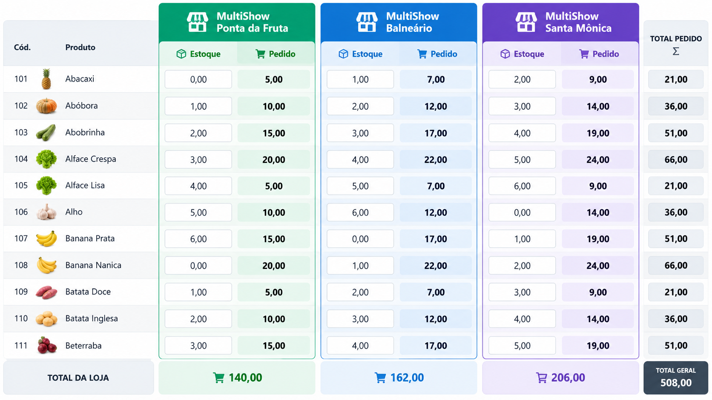
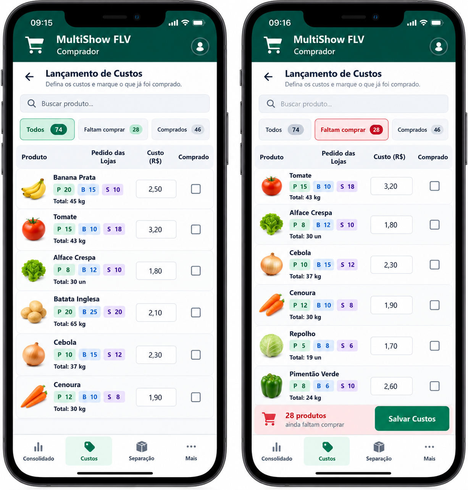

# MultiShow FLV - Especificação consolidada para desenvolvimento

## 1. Objetivo

Construir um sistema web/mobile para controlar o fluxo de FLV (frutas,
legumes e verduras) da rede MultiShow, substituindo o processo atual
feito principalmente por WhatsApp e planilhas.

O sistema deve cobrir, de forma simples e operacional:

1.  lançamento de estoque e pedido pelas lojas;
2.  consolidação dos pedidos pelo comprador;
3.  lançamento de custos e acompanhamento do que ainda falta comprar;
4.  relatório de separação e status de embarque;
5.  pedido específico para um fornecedor fixo de itens exclusivos;
6.  precificação e administração pelo Gestor;
7.  histórico de pedidos;
8.  controle de notas fiscais recebidas/pendentes.

A prioridade é **simplicidade no uso real, especialmente no celular**.
Evitar adicionar etapas operacionais que não sejam necessárias.

------------------------------------------------------------------------

## 2. Unidades

Existem três lojas e os nomes devem ser usados em toda a interface,
relatórios e histórico:

-   **MultiShow Ponta da Fruta**
-   **MultiShow Balneário**
-   **MultiShow Santa Mônica**

Não usar "Loja 01/02/03" na interface final, salvo como identificadores
internos se necessário.

------------------------------------------------------------------------

## 3. Perfis e permissões

### 3.1 Loja

Cada loja só acessa seus próprios dados.

Pode:

-   lançar estoque atual;
-   lançar quantidade do pedido;
-   salvar/enviar o pedido;
-   consultar o próprio histórico;
-   imprimir relatório de conferência de recebimento;
-   visualizar custo e preço sugerido, se essa informação continuar
    disponível na tela desktop.

Não pode:

-   acessar painel do Comprador;
-   acessar painel do Gestor;
-   cadastrar ou alterar produtos;
-   visualizar pedidos das outras lojas.

### 3.2 Comprador

O módulo do Comprador foi considerado **aprovado como base**.

Pode:

-   visualizar consolidado das três lojas;
-   visualizar estoque e pedido de cada loja;
-   lançar custo dos produtos;
-   marcar produto como comprado;
-   filtrar produtos que ainda faltam comprar;
-   imprimir relatório de separação por loja;
-   marcar apenas o status **Embarcado / Não embarcado**;
-   gerar o **Pedido do Fornecedor** para itens exclusivos.

Não deve:

-   informar quantidade efetivamente comprada nesta fase;
-   administrar produtos;
-   fazer alterações de cadastro;
-   administrar markup/precificação.

### 3.3 Gestor

Pode fazer tudo que o Comprador pode, além de:

-   precificação;
-   cadastro/alteração/inativação de produtos;
-   histórico de pedidos das três lojas;
-   controle de notas fiscais;
-   visão gerencial.

A tela de precificação atual foi aprovada. Evitar redesenhá-la sem
necessidade.

------------------------------------------------------------------------

## 4. Cadastro de produtos

A planilha-base mais recente está incluída neste pacote como:

`base_produtos_atual.xlsx`

Ela contém **74 produtos**.

Campos relevantes:

-   código interno do ERP;
-   mercadoria/produto;
-   markup individual;
-   formato/tipo de compra;
-   identificação de item exclusivo do fornecedor fixo.

Há **21 itens marcados como exclusivos do fornecedor** na planilha
atual.

### 4.1 Unidade x formato de compra

São conceitos diferentes.

Exemplo: a loja pode controlar/pedir um produto em KG, mas o comprador
adquirir em CX.

Por enquanto **não fazer conversão automática** entre KG, CX, SC, UND
etc.

Na tela do Comprador, mostrar o **formato de compra cadastrado**.

A conversão (ex.: 1 CX = 15 kg) será implementada futuramente, após
validação do processo real.

### 4.2 Fotos dos produtos - versão futura com banco

Na versão definitiva com banco de dados, cada produto poderá ter foto.

Campos futuros sugeridos:

-   código;
-   nome;
-   unidade;
-   formato de compra;
-   markup;
-   foto;
-   ativo/inativo;
-   fornecedor/vendedor, futuramente.

As fotos devem ser miniaturas leves, especialmente nas telas mobile.
Produtos sem foto podem usar placeholder.

------------------------------------------------------------------------

## 5. Fluxo principal

Fluxo operacional simplificado:

**Loja lança estoque + pedido -\> envia pedido -\> Comprador vê
consolidado -\> Comprador lança custos e marca o que foi comprado -\>
imprime separação -\> marca embarcado -\> Gestor acompanha / precifica /
controla NF**

Evitar criar etapas adicionais de paletização digital nesta fase.

------------------------------------------------------------------------

## 6. Pedido das lojas

### 6.1 Desktop

Pode continuar em formato de tabela.

Campos principais:

-   produto;
-   estoque;
-   pedido.

### 6.2 Mobile - requisito importante

O teste real mostrou que tabela com rolagem horizontal é pouco prática.

No celular, cada produto deve aparecer como **cartão vertical**, sem
necessidade de rolar horizontalmente.

Cada cartão deve ter:

-   nome do produto;
-   futuramente foto/miniatura;
-   campo grande `Estoque atual`;
-   campo grande `Pedido`;
-   indicador visual quando o item já tiver sido preenchido.

No topo:

-   busca por produto;
-   filtro `Todos`;
-   filtro `Sem pedido`;
-   filtro `Com pedido`.

Ações:

-   `Limpar`;
-   `Salvar Pedido`.

Referência visual:


------------------------------------------------------------------------

## 7. Histórico das lojas

Cada loja deve visualizar somente seus próprios pedidos.

O histórico deve ser persistente, não apenas sobrescrever o pedido do
dia.

Estrutura conceitual:

``` text
Order
- id
- store_id
- order_date
- created_at
- items[]
  - product_id
  - stock
  - ordered_quantity
```

A loja deve conseguir abrir um pedido antigo e visualizar os itens.

O Gestor deve conseguir visualizar o histórico das três lojas e filtrar
por loja/data.

------------------------------------------------------------------------

## 8. Relatório de conferência da loja

Relatório A4 para conferência física no recebimento.

Mostrar somente produtos com pedido maior que zero.

Campos:

-   código interno ERP;
-   produto;
-   unidade;
-   quantidade pedida;
-   campo em branco para peso/quantidade recebida.

Cabeçalho:

-   loja;
-   data do pedido;
-   data de recebimento em branco;
-   responsável pela conferência em branco.

------------------------------------------------------------------------

## 9. Consolidado do Comprador

O consolidado deve mostrar **estoque e pedido lado a lado para cada
loja**.

Conceito desktop:

``` text
Produto
| Ponta da Fruta: Estoque | Pedido
| Balneário: Estoque | Pedido
| Santa Mônica: Estoque | Pedido
| Total Pedido
```

As lojas devem ficar visualmente separadas em boxes/blocos.

Referência visual:


### 9.1 Loja que ainda não enviou

Se uma loja ainda não enviou o pedido do dia:

-   box/cabeçalho da loja em **vermelho-claro**;
-   texto `Pedido pendente`.

Depois que enviar, voltar à aparência normal.

Isso deve deixar claro que o consolidado ainda está incompleto.

### 9.2 Mobile

No celular, evitar tabela horizontal extensa.

Pode usar cards por produto mostrando cada loja em um pequeno bloco:

``` text
BANANA PRATA

Ponta da Fruta
Est. 8 | Ped. 20

Balneário
Est. 5 | Ped. 25

Santa Mônica
Est. 12 | Ped. 15

Total pedido: 60
```

------------------------------------------------------------------------

## 10. Lançamento de custos - Comprador

Essa tela foi redesenhada após feedback do comprador e o conceito foi
aprovado.

Remover da tela mobile:

-   código do produto;
-   preço sugerido;
-   formato de compra como coluna separada.

Mostrar:

-   produto;
-   pedido de cada loja;
-   total;
-   formato de compra;
-   campo `Custo (R$)`;
-   checkbox `Comprado`.

Identificação compacta das lojas:

-   `P` = Ponta da Fruta;
-   `B` = Balneário;
-   `S` = Santa Mônica.

Filtros:

-   `Todos`;
-   `Faltam comprar`;
-   `Comprados`.

Busca:

-   `Buscar produto...`

O filtro **Faltam comprar** funciona como lista de trabalho do comprador
durante a compra.

Conforme ele compra:

1.  lança o custo;
2.  marca `Comprado`;
3.  o item deixa a lista de pendentes.

Quando não houver pendentes, indicar claramente que todos os produtos
foram marcados como comprados.

### 10.1 Formato de compra

Por enquanto, o total deve usar o formato cadastrado na planilha.

Exemplo visual:

``` text
Banana Prata
P 20 | B 15 | S 10
Total: 45 CX
Custo: R$ 2,50
[ ] Comprado
```

**Importante:** isso é apenas exibição do formato de compra. Não existe
conversão matemática nesta fase.

Referência visual:


A referência mais recente, incluindo o formato de compra:


------------------------------------------------------------------------

## 11. Custos e histórico de custos

O custo deve possuir histórico por produto e data.

Não armazenar apenas um único custo atual.

Estrutura conceitual:

``` text
ProductCost
- id
- product_id
- date
- cost
- created_at
- created_by
```

Isso permite comparar custo anterior e custo atual corretamente.

------------------------------------------------------------------------

## 12. Precificação - Gestor

A precificação atual foi aprovada.

Regra:

``` text
preço_sugerido = custo_atual * (1 + markup / 100)
```

Exemplo:

``` text
Custo = R$ 10,00
Markup = 150%
Preço sugerido = R$ 25,00
```

O markup é individual por produto, vindo da planilha/cadastro.

Colunas sugeridas:

-   Produto;
-   Custo anterior;
-   Custo atual;
-   Diferença;
-   Markup;
-   Preço sugerido.

### 12.1 Destaque vermelho

**Somente alteração de custo deve ficar em vermelho.**

Não destacar alteração de estoque ou pedido.

Filtro aprovado:

`Somente custos alterados`

Se não existir custo anterior, tratar como primeiro custo/sem histórico
em vez de fingir que houve alteração de zero.

------------------------------------------------------------------------

## 13. Separação e embarque

Nesta fase manter simples.

O Comprador imprime um relatório de separação por loja.

Campos:

-   checkbox manual;
-   código;
-   produto;
-   unidade;
-   quantidade da loja.

Rodapé:

-   campo/checkbox `EMBARCADO`;
-   responsável;
-   horário.

No sistema existe somente:

-   `Não embarcado`;
-   `Embarcado`.

Ao marcar embarcado, guardar internamente:

-   data;
-   horário.

Não implementar ainda:

-   paletização digital;
-   QR Code;
-   leitura de código de barras;
-   controle detalhado de volumes.

Essas ideias ficam para evolução posterior.

------------------------------------------------------------------------

## 14. Pedido do fornecedor fixo

A planilha identifica produtos exclusivos de um fornecedor fixo.

O sistema deve selecionar automaticamente somente esses produtos.

O Comprador possui uma área:

`Pedido Fornecedor`

Relatório deve ser **separado por loja** e mostrar:

-   produto;
-   quantidade;
-   custo.

As lojas:

-   MultiShow Ponta da Fruta;
-   MultiShow Balneário;
-   MultiShow Santa Mônica.

### 14.1 Regra de impressão obrigatória

Cada loja deve começar em uma **nova folha**.

Exemplo:

-   Página 1: Ponta da Fruta;
-   Página 2: Balneário;
-   Página 3: Santa Mônica.

Se uma loja ocupar mais de uma página, pode continuar normalmente.

Porém, a loja seguinte nunca deve começar aproveitando o espaço restante
da loja anterior.

Usar CSS de impressão equivalente a:

``` css
.supplier-store + .supplier-store {
  break-before: page;
  page-break-before: always;
}
```

O cabeçalho de cada seção deve conter nome da loja e data.

Se alguma loja ainda não enviou o pedido, o relatório deve alertar que o
pedido está pendente.

------------------------------------------------------------------------

## 15. Controle de Notas Fiscais - Gestor

Foi solicitado um controle simples de NF.

Objetivo: identificar rapidamente **qual produto de qual dia ainda está
sem nota fiscal**.

A tela deve listar registros de compra/custo por data.

Campos iniciais:

-   data da compra;
-   produto;
-   custo;
-   checkbox `NF recebida`;
-   status;
-   data/hora da marcação, quando recebida.

Filtros:

-   `Pendentes`;
-   `Recebidas`;
-   `Todas`.

Indicadores:

-   total de registros;
-   quantidade de NF pendentes;
-   quantidade recebida.

Um produto comprado em datas diferentes deve gerar controles
independentes.

Ou seja, a NF pertence à **movimentação/compra daquele dia**, não ao
cadastro permanente do produto.

Estrutura conceitual:

``` text
InvoiceControl
- id
- purchase_date
- product_id
- cost_id / purchase_id
- invoice_received
- invoice_received_at
- supplier_id nullable
- seller_id nullable
```

### 15.1 Evolução futura

Posteriormente cadastrar:

-   fornecedores;
-   vendedores;
-   de quem o produto foi comprado.

Isso permitirá filtrar:

`Notas pendentes - Fornecedor X`

Não é necessário implementar fornecedor/vendedor agora, mas o modelo de
dados deve permitir acrescentar sem refazer todo o controle.

------------------------------------------------------------------------

## 16. Cadastro/alteração de produtos - Gestor

Somente Gestor.

Deve permitir:

-   criar produto;
-   editar nome;
-   editar unidade;
-   editar formato de compra;
-   editar markup;
-   marcar produto exclusivo do fornecedor;
-   inativar/ativar produto.

Preferir inativação em vez de exclusão física, para preservar
históricos.

Futuramente:

-   foto;
-   fornecedor padrão;
-   fator de conversão de compra.

------------------------------------------------------------------------

## 17. Fotos dos produtos - direção de UX

As imagens conceituais geradas mostram fotos de frutas/verduras para
facilitar identificação.

Isso **não está implementado no protótipo local atual**, mas deve fazer
parte da versão com banco de dados.

Prioridade de exibição:

1.  pedido mobile das lojas;
2.  lançamento de custos do Comprador;
3.  cadastro do produto.

Requisitos:

-   miniaturas comprimidas;
-   carregamento rápido;
-   placeholder quando não houver foto;
-   Gestor pode enviar foto pelo celular ou selecionar arquivo.

------------------------------------------------------------------------

## 18. Banco de dados - direção recomendada

O protótipo atual usa `localStorage` e não é multiusuário.

A versão real deve usar autenticação e banco compartilhado.

A arquitetura discutida anteriormente considerou uma solução web/PWA com
backend como Supabase e hospedagem web como Cloudflare Pages, mas a
implementação pode escolher tecnologia equivalente.

Entidades mínimas sugeridas:

``` text
users
stores
products
orders
order_items
product_costs
purchase_status
shipments
invoice_controls
supplier_exclusive_products
```

Futuro:

``` text
suppliers
sellers
product_purchase_conversions
product_images
```

### 18.1 Regras importantes

-   cada loja só acessa os próprios pedidos;
-   Comprador acessa todas as lojas, mas não administra
    produtos/precificação;
-   Gestor possui acesso completo;
-   histórico nunca deve ser perdido por sobrescrita;
-   alterações importantes devem guardar data/hora e, futuramente,
    usuário responsável.

------------------------------------------------------------------------

## 19. UX mobile - princípios aprovados

A aplicação será usada bastante em celular.

Princípios:

-   evitar rolagem horizontal;
-   inputs grandes;
-   botões fáceis de tocar;
-   busca de produto;
-   filtros rápidos;
-   cards verticais para tarefas operacionais;
-   cores/boxes para diferenciar lojas;
-   poucas etapas;
-   preservar contexto durante rolagem;
-   mostrar claramente pendências;
-   não transformar o fluxo em um ERP complexo.

------------------------------------------------------------------------

## 20. Referências visuais incluídas

### 20.1 Consolidado por boxes

Arquivo:

`referencias_visuais/01_consolidado_boxes_lojas.png`



Características a aproveitar:

-   loja verde / azul / roxo;
-   estoque e pedido visualmente agrupados;
-   total do pedido destacado;
-   leitura rápida de onde uma loja termina e outra começa.

### 20.2 Comprador - custos mobile

Arquivo:

`referencias_visuais/02_comprador_custos_mobile.png`



Características:

-   busca;
-   filtros Todos / Faltam comprar / Comprados;
-   pedido das lojas em chips;
-   custo;
-   checkbox comprado;
-   contador de pendências.

### 20.3 Loja + Comprador mobile

Arquivo:

`referencias_visuais/03_loja_pedido_e_comprador_mobile.png`


Esta é a referência mais importante para mobile.

Características da loja:

-   cards por produto;
-   Estoque atual e Pedido lado a lado;
-   busca;
-   Todos / Sem pedido / Com pedido;
-   botão Salvar Pedido;
-   foto do produto futuramente.

Características do Comprador:

-   chips P/B/S;
-   formato de compra;
-   custo;
-   checkbox comprado;
-   filtro Faltam comprar.

------------------------------------------------------------------------

## 21. Protótipo atual

O arquivo mais recente incluído no pacote é:

`multishow_flv_v8_teste.html`

Ele é um protótipo local em HTML/JavaScript usando `localStorage`.

Já contém grande parte das regras discutidas, incluindo:

-   74 produtos;
-   três lojas com nomes reais;
-   perfis Loja / Comprador / Gestor;
-   pedido mobile em cards;
-   histórico;
-   consolidado;
-   custos;
-   comprado/pendente;
-   separação/embarque;
-   pedido do fornecedor;
-   precificação;
-   cadastro de produtos;
-   controle inicial de NF;
-   impressão com quebra por loja no fornecedor.

O protótipo deve ser usado como **referência funcional**, não como
arquitetura final.

------------------------------------------------------------------------

## 22. Itens explicitamente adiados

Não implementar agora, salvo nova solicitação:

-   quantidade efetivamente comprada pelo comprador;
-   conversão KG \<-\> CX/SC/UND;
-   paletização digital detalhada;
-   QR Code;
-   leitura de código de barras;
-   integração com balança;
-   fornecedores/vendedores completos;
-   cobrança automática de NF;
-   fotos no protótipo local;
-   integrações com ERP.

------------------------------------------------------------------------

## 23. Prioridade para implementação no Codex

Sugestão de ordem:

1.  criar banco e autenticação;
2.  implementar perfis/permissões;
3.  importar os 74 produtos da planilha atual;
4.  pedidos das lojas com UX mobile em cards;
5.  histórico de pedidos;
6.  consolidado com boxes e alerta de loja pendente;
7.  custos do Comprador + comprado/faltam comprar;
8.  separação + embarcado;
9.  pedido do fornecedor exclusivo + impressão por loja;
10. precificação do Gestor;
11. cadastro de produtos;
12. controle de NF;
13. fotos de produtos;
14. somente depois avaliar conversões e fornecedores/vendedores.

------------------------------------------------------------------------

## 24. Critérios de aceite essenciais

O sistema só deve ser considerado pronto para uso inicial quando:

-   uma loja consegue lançar pedido pelo celular sem rolagem horizontal;
-   cada loja enxerga somente seus dados;
-   o Comprador enxerga claramente se alguma loja não enviou;
-   o Comprador consegue trabalhar pelo filtro `Faltam comprar`;
-   custos ficam registrados historicamente;
-   o relatório do fornecedor contém somente itens exclusivos;
-   cada loja começa em nova página nesse relatório;
-   o Gestor consegue identificar produtos/datas com NF pendente;
-   a precificação usa markup individual;
-   somente alteração real de custo recebe destaque vermelho;
-   todos os dados são compartilhados via banco, não `localStorage`.

------------------------------------------------------------------------

## 25. Observação final para o agente de desenvolvimento

Este documento consolida decisões tomadas após vários ciclos de
protótipo e feedback de uso real no celular.

Ao implementar, priorize **preservar o fluxo aprovado** em vez de
acrescentar funcionalidades por conta própria.

Quando houver dúvida entre uma solução mais completa e uma mais simples,
prefira a solução simples que mantenha:

-   velocidade de lançamento;
-   clareza visual;
-   poucos cliques;
-   rastreabilidade suficiente;
-   possibilidade de evolução futura.
